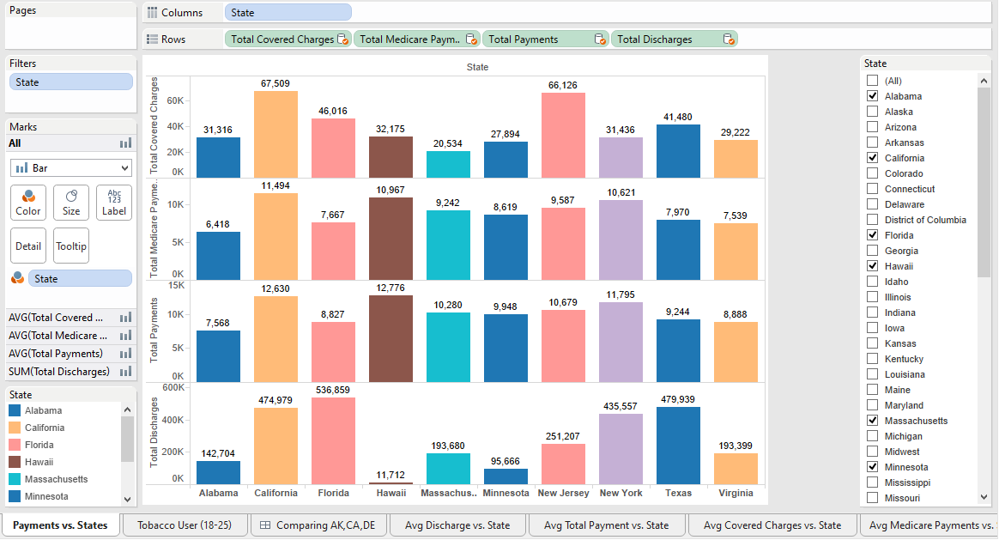
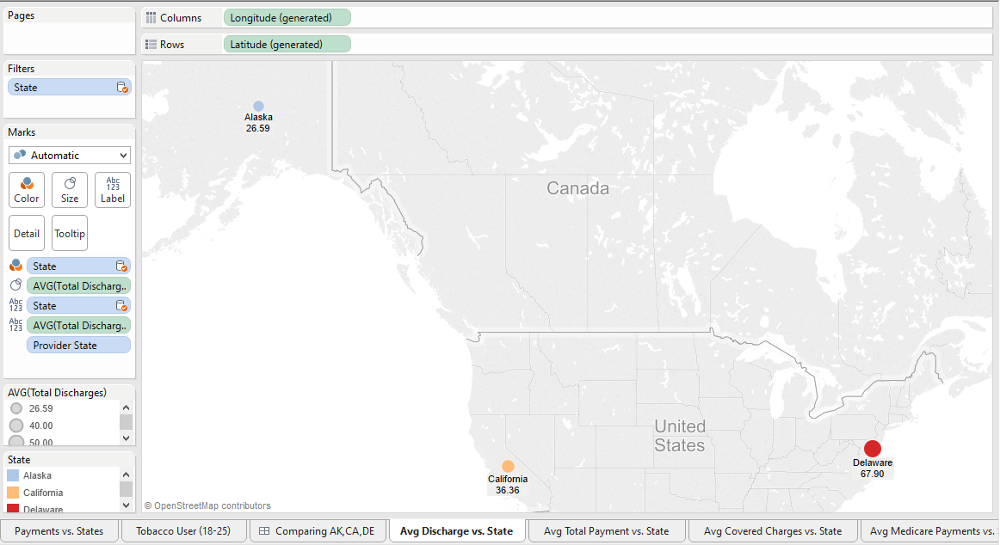

<!-- rmarkdown v1 -->
  
# Project 6
  
### Created by Asif Chowdhury, Justin Owens, Jash Choraria
  
This is the sixth project for CS 329E Data Visualization. 
The data we will utilize comes from data.CMS.gov. 
The topic is exploring possible relationships between smoking prevalence, treatement providers and their charges.
The goals for this project are to create visualizations using data blending.

In order to reproduce this project, please follow the following instructions.

## Step 1

#### Load the correct packages into R

Use the following code to load the correct packages into RStudio.
It might be necessary to install them manually if they have never been installed on your machince prior to this experience.


```r
source("../00 Doc/Packages.R", echo = TRUE)
```

```
## 
## > require(plyr)
## 
## > require(dplyr)
## 
## > require(knitr)
## 
## > require(reshape2)
## 
## > require(RCurl)
## 
## > require(plyr)
## 
## > require(tidyr)
## 
## > require(jsonlite)
## 
## > require(lubridate)
```

## Step 2

#### Clean up the CSV files

Sometimes, the data in a CSV file is incompatible with Oracle. In this situation, we would want to clean up the data. 
Make sure the CSV file is in the appropriate place, as defined by the following code, and modify the working directory in line 1 for your machine. Then run the code in order to get rid of special characters and set data types that are compatible with Oracle. 
You should now have a new CSV File with the reformatted data. This HTML is not dependent on the modified CSV, but if you would like to reproduce our modified CSV, follow the code found in the ReformattingData.R file in the 00 Doc folder. Repeat this for all CSV files.

## Step 3

#### Import Data to Oracle and retrieve using Tableau

We need to upload the CSV file to the Oracle cloud for retrieval using Tableau.

After doing so, connect to Oracle 

1) Open Tableau.

2) Click Connect to "Oracle" underneath the Connect heading on the left side of the screen.

3) In the screen that appears, enter the required information. For our project, the information is:
  
Server: 129.152.144.84

Service: ORCL.usuniversi01134.oraclecloud.internal

Port: 1521

Username: C##cs329e_jdo589

Password: orcl_jdo589

4) Repeat this step for any other data sources to use when blending data. 

In our project, we blended two data sets from the same data source. Because of that we used the same server information to get the second data set from Oracle.

## Step 4

#### Data blending

Data blending is essentially combining data from multiple data sources. If you do not use the joining function in Tableau, you must specify the relationship between columns in each data source by using the edit relationships function under the Data menu. 

For our data, we needed to create a relationship between the state in one table and the state in the other.


## Step 5

#### Create the visualizations

The visualizations can be recreated by dragging the correct Dimensions and Measures to the proper places as decribed in the following pictures and completing all the steps outlined beneath each screenshot below.

For each visual, be sure to click on the new sheet button so that you can save each of your visualizations.

### Payments vs. States:
  


This data blending is being grouped by States and is showing all the average total payments that were made by each patient, their insurance and medicare program. We added a quick filter on the right side to give the viewers a freedom to choose the states that they want to compare.

To create this worksheet, we dragged "states" column from the "Tobaccousage" dataset to columns, Filter and color. Then we dragged "Total Covered States", "Total Madicare Payments", "Total Payments", "Total Discharges" columns from "Diagnoses" dataset to rows. Lastly we changed the measure of "Total Covered States", "Total Madicare Payments", "Total Payments" to average.

### Tobacco Users (AgeGroup 18-25) vs. States:
  


This data blending is showing The propotion of tobacco users between the age group of 18-25 and the average discharged patients from the diagnoses providers in each state.

To create this worksheet, we dragged "Longitude (generated)" from measures of the "Diagnoses" dataset to columns and "Latitude (generated)" from measures of the same dataset to rows. Also dragged "Total discharged" from the same datasets to lables and changed the calculated measure to average. Lastly, from the "Tobaccousage" dataset, we dragged "state" to color and label, and "18 25 Estimate" to label and size.

**The steps to create the following data blending worksheets are going to be very similar. We created those worksheets to compare them in a dashboard or on the same screen which we will explain at the end.**

### Avg Discharge vs. States:
  


This worksheet is showing average discharged patients of Alaska, California and Delaware. 

To create this data blending worksheet, we dragged "Longitude (generated)" from measures of the "Diagnoses" dataset to columns and "Latitude (generated)" from measures of the same dataset to rows. Also dragged "Total discharged" from the same datasets to size and lable, and changed the calculated measure to average. Lastly, from the "Tobaccousage" dataset, we dragged "state" to color, label and filter. Then filter to only those states that are shown on the picture above.

### Avg Total Payments vs. States:
  


This worksheet is showing average total payments that were made by each patient of Alaska, California and Delaware.

To create this data blending worksheet, we followed the exact same steps as the "Ave Discharge vs. States" worksheet. Only step that is different is that instead of using "Total discharged", we dragged "Total Payments" to size and label.

### Avg Total Covered Chagres vs. States:


This worksheet is showing average total payments that were made by insurance companies of Alaska, California and Delaware.

To create this data blending worksheet, we followed the exact same steps as the "Ave Discharge vs. States" worksheet. Only step that is different is that instead of using "Total discharged", we dragged "Total Covered Charges" to size and label.

### Avg Total Medicare Payments vs. States:


This worksheet is showing average total payments that were made by insurance companies of Alaska, California and Delaware.

To create this data blending worksheet, we followed the exact same steps as the "Ave Discharge vs. States" worksheet. Only step that is different is that instead of using "Total discharged", we dragged "Total Medicare Payments" to size and label.

### Comparision Between Alaska, California and Delaware:


This visualization compares the above four data blending worksheets. 

To create this visualization, first right click on one of the title of the worksheets and click on the "New Dashboard" which will create a dashboard and let us add the available worksheets and compare them. 

For this project, we dragged "Avg Discharge vs. State", "Avg Total Payment vs. State", "Avg Total Covered Charges vs. State" and "Avg Medicare Payments vs. State" to the dashboard one by one and adjusted thier sizes.

### We created this dashboard to show that this comparison tells us that less tobacco users are getting sick and being treated in Alaska comparing to other states while the Alaskan residents recieve the most government fund to pay their treatment fees. On the other hand, in California, most of the patients bill are being paid by their insurance. 
