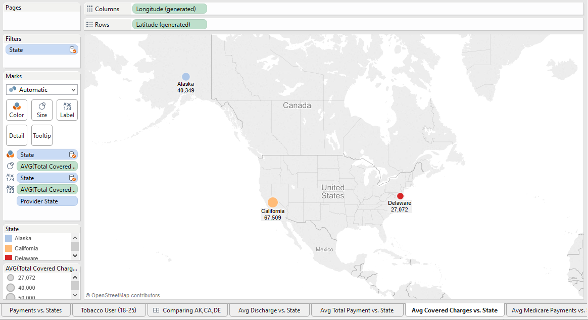

<!-- rmarkdown v1 -->
  
# Project 6
  
### Created by Asif Chowdhury, Justin Owens, Jash Choraria
  
This is the sixth project for CS 329E Data Visualization. 
The data we will utilize comes from data.CMS.gov. 
The topic is exploring possible relationships between smoking prevalence and insurance charges.
The goals for this project are to create visualizations using data blending.

In order to reproduce this project, please follow the following instructions.

## Step 1

#### Load the correct packages into R

Use the following code to load the correct packages into RStudio.
It might be necessary to install them manually if they have never been installed on your machince prior to this experience.


```r
source("../00 Doc/Packages.R", echo = TRUE)
```

```
## 
## > require(plyr)
## 
## > require(dplyr)
## 
## > require(ggplot2)
```

```
## Warning: package 'ggplot2' was built under R version 3.1.3
```

```
## 
## > require(knitr)
## 
## > require(reshape2)
## 
## > require(RCurl)
## 
## > require(grid)
## 
## > require(plyr)
## 
## > require(gplots)
## 
## > require(tidyr)
## 
## > require(jsonlite)
```

```
## Warning: package 'jsonlite' was built under R version 3.1.3
```

```
## 
## > require(ggthemes)
```

```
## Warning: package 'ggthemes' was built under R version 3.1.3
```

## Step 2

#### Clean up the CSV files

Sometimes, the data in a CSV file is incompatible with Oracle. In this situation, we would want to clean up the data. 
Make sure the CSV file is in the appropriate place, as defined by the following code, and modify the working directory in line 1 for your machine. Then run the code in order to get rid of special characters and set data types that are compatible with Oracle. 
You should now have a new CSV File with the reformatted data. This HTML is not dependent on the modified CSV, but if you would like to reproduce our modified CSV, follow the code found in the ReformattingData.R file in the 00 Doc folder. Repeat this for all CSV files.

## Step 3

#### Import Data to Oracle and retrieve using Tableau

We need to upload the CSV file to the Oracle cloud for retrieval using Tableau.

After doing so, connect to Oracle 

1) Open Tableau.

2) Click Connect to "Oracle" underneath the Connect heading on the left side of the screen.

3) In the screen that appears, enter the required information. For our project, the information is:
  
Server: 129.152.144.84

Service: ORCL.usuniversi01134.oraclecloud.internal

Port: 1521

Username: C##cs329e_jdo589

Password: orcl_jdo589

4) Repeat this step for any other data sources to use when blending data.

## Step 4

#### Data blending

Data blending is essentially combing data from multiple data sources. If you do not use the joining function in Tableau, you must specify the relationship between columns in each data source by using the edit relationships function under the Data menu. 

For our data, we needed to create a relationship between the state in one table and the state in the other.

## Step 5

#### Create the visualizations

The visualizations can be recreated by dragging the correct Dimensions and Measures to the proper places as decribed in the following pictures and completing all the steps outlined beneath each screenshot below.

For each visual, be sure to click on the new sheet button so that you can save each of your visualizations.

**Visual 1:**
  

